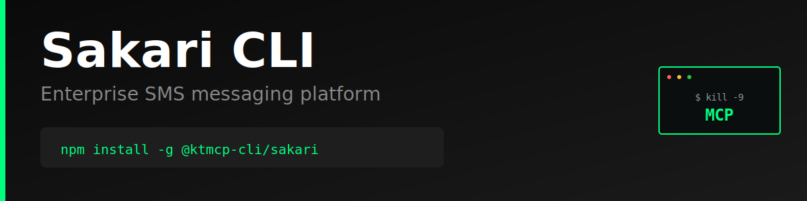

> "Six months ago, everyone was talking about MCPs. And I was like, screw MCPs. Every MCP would be better as a CLI."
>
> — [Peter Steinberger](https://twitter.com/steipete), Founder of OpenClaw
> [Watch on YouTube (~2:39:00)](https://www.youtube.com/@lexfridman) | [Lex Fridman Podcast #491](https://lexfridman.com/peter-steinberger/)

# Sakari CLI

Production-ready command-line interface for the [Sakari API](https://www.sakari.io/) - Enterprise SMS messaging platform.

> **⚠️ Unofficial CLI** - This tool is not officially sponsored, endorsed, or maintained by Sakari. It is an independent project built on the public Sakari API. API documentation: https://developers.sakari.io/

## Features

- Send and receive SMS messages globally
- Manage contacts and contact groups
- Track message delivery status
- Account management
- Simple, intuitive command structure
- JSON and pretty-print output formats
- Persistent configuration storage
- Progress indicators for long-running operations

## Why CLI > MCP

### The MCP Problem

Model Context Protocol (MCP) servers introduce unnecessary complexity and failure points for API access:

1. **Extra Infrastructure Layer**: MCP requires running a separate server process that sits between your AI agent and the API
2. **Cognitive Overhead**: Agents must learn MCP-specific tool schemas on top of the actual API semantics
3. **Debugging Nightmare**: When things fail, you're debugging three layers (AI → MCP → API) instead of two (AI → API)
4. **Limited Flexibility**: MCP servers often implement a subset of API features, forcing you to extend or work around limitations
5. **Maintenance Burden**: Every API change requires updating both the MCP server and documentation

### The CLI Advantage

A well-designed CLI is the superior abstraction for AI agents:

1. **Zero Runtime Dependencies**: No server process to start, monitor, or crash
2. **Direct API Access**: One hop from agent to API with transparent HTTP calls
3. **Human + AI Usable**: Same tool works perfectly for both developers and agents
4. **Self-Documenting**: Built-in `--help` text provides complete usage information
5. **Composable**: Standard I/O allows piping, scripting, and integration with other tools
6. **Better Errors**: Direct error messages from the API without translation layers
7. **Instant Debugging**: `--json` gives you the exact API response for inspection

**Example Complexity Comparison:**

MCP approach:
```
AI Agent → MCP Tool Schema → MCP Server → HTTP Request → API → Response Chain (reverse)
```

CLI approach:
```
AI Agent → Shell Command → HTTP Request → API → Direct Response
```

The CLI is simpler, faster, more reliable, and easier to debug.

## Installation

```bash
npm install -g @ktmcp-cli/sakari
```

## Configuration

### Set API Credentials

Get your API credentials from https://hub.sakari.io/

```bash
sakari config set clientId YOUR_CLIENT_ID
sakari config set clientSecret YOUR_CLIENT_SECRET
sakari config set accountId YOUR_ACCOUNT_ID
```

### Environment Variables

Alternatively, use environment variables:

```bash
export SAKARI_CLIENT_ID=your_client_id
export SAKARI_CLIENT_SECRET=your_client_secret
export SAKARI_ACCOUNT_ID=your_account_id
export SAKARI_BASE_URL=https://api.sakari.io/v1  # Optional
```

### View Configuration

```bash
# Show all config
sakari config list

# Get specific value
sakari config get clientId

# Clear config
sakari config clear
```

## Usage

### Send Messages

```bash
# Send a simple SMS
sakari messages send --to "+12345678900" --from "+10987654321" --body "Hello World"

# Get JSON response
sakari messages send --to "+12345678900" --from "+10987654321" --body "Hello" --json
```

### List Messages

```bash
# List recent messages
sakari messages list --limit 50

# Paginate through messages
sakari messages list --limit 50 --offset 50

# Get specific message
sakari messages get <message-id>
```

### Manage Contacts

```bash
# List contacts
sakari contacts list --limit 50

# Create a contact
sakari contacts create --mobile "+12345678900" --first "John" --last "Doe"

# Get contact by ID
sakari contacts get <contact-id>
```

### Account Management

```bash
# List all accounts
sakari accounts list

# Get specific account
sakari accounts get <account-id>
```

## Output Formats

All commands support `--json` flag for machine-readable output:

```bash
sakari messages list --json | jq '.data[0]'
```

## Error Handling

The CLI provides clear error messages with suggestions:

```bash
$ sakari messages send --to "+1234567890" --from "+0987654321" --body "Test"
✗ Client ID not configured. Set it with: sakari config set clientId <your-client-id>
```

## Development

```bash
# Clone and install
git clone https://github.com/ktmcp-cli/sakari.git
cd sakari
npm install

# Link locally
npm link

# Run
sakari --help
```

## License

MIT

## Links

- [Sakari Website](https://www.sakari.io/)
- [Sakari API Documentation](https://developers.sakari.io/)
- [GitHub Repository](https://github.com/ktmcp-cli/sakari)
- [npm Package](https://www.npmjs.com/package/@ktmcp-cli/sakari)
